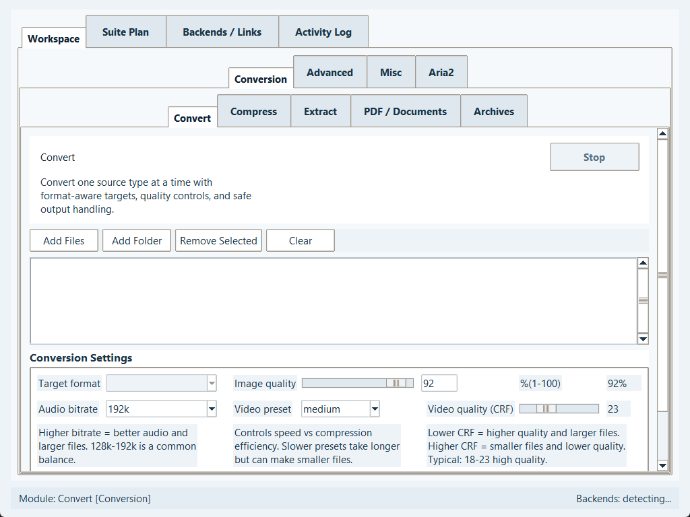
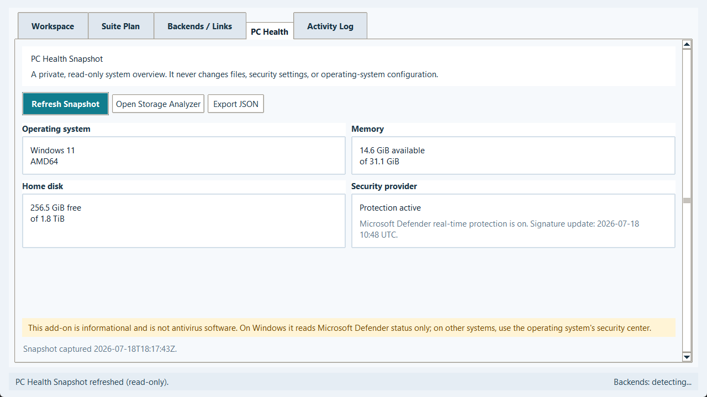
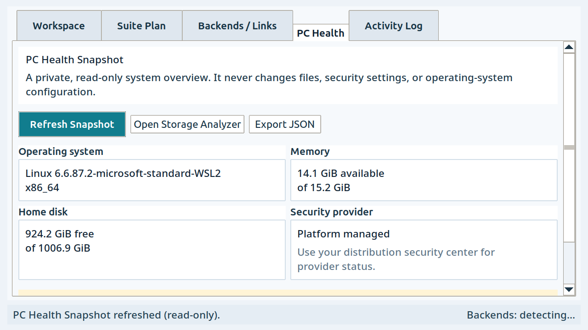

# Format Foundry Beta 0.5 Optimization Audit

Audit date: 2026-07-18
Scope: Windows 11, Ubuntu 24.04 under WSL2, shared Python/Tk runtime, updater, optional add-ons,
backend discovery, settings and job persistence, website contracts, packaging, CI, release security,
and responsive desktop layout.

## Executive Result

The Beta 0.5 code and local package set are operational. The pass closed the highest-risk runtime,
packaging, release, and accessibility defects that could be fixed inside the repository without a
public signing identity or a separate physical Ubuntu desktop.

- Windows source, frozen app, updater, installer, and fast-start portable ZIP passed.
- Ubuntu source, six real backends, frozen app/updater, Debian package, AppImage, and tarball passed.
- The regular suite reports 80 tests with six explicit real-backend skips; those same six integration
  tests pass separately with the installed Ubuntu tools.
- Ruff and strict mypy pass across the dependency-light foundations, shared backend/runtime code,
  both built-in add-ons, and quality tools.
- `pip-audit` reports no known dependency vulnerabilities, and reproducible CycloneDX SBOMs build.
- Eight responsive-layout cases pass on both platforms, including 1024x768 and 1280x720 at 150%.

The principal code-maintenance risk is now structural rather than immediately functional:
`modular_file_utility_suite.py` is 12,202 lines. Decomposition should be gradual and test-backed,
not attempted as a release-day rewrite.

## Implemented Changes

| Priority | Change | Verified result |
| --- | --- | --- |
| P0 | Canonical Beta identity and migration contract | App, updater, installer, Debian metadata, website, and tests use Beta 0.5 / `0.5.0-beta`; legacy Alpha clients use transport tag `v1.8.18`. |
| P0 | Fail-closed tagged Windows signing | Tagged publication cannot proceed without a trusted, timestamped Azure Artifact Signing or CA-issued PFX identity. Self-signed public releases are rejected. |
| P0 | Hash-bound release provenance | Executables carry a stable product identity; release CI generates checksums, provenance, SBOM/audit evidence, and GitHub attestations. |
| P0 | Ubuntu package hardening | Debian and AppImage staging moved to a native Linux temporary filesystem, CRLF launcher templates are normalized, and AppStream metadata validates. |
| P0 | Native backend selection | Linux rejects Windows `.exe` tools exposed by WSL and selects native Linux executables. |
| P1 | Real backend integration tests | FFmpeg/FFprobe, Pandoc, LibreOffice, 7-Zip, ImageMagick, and aria2 complete real fixture workflows on Ubuntu 24.04. |
| P1 | Versioned settings and recovery | Settings have explicit schema migration, atomic replacement, future-version protection, and corrupt-file recovery copies. |
| P1 | Persistent job ledger | SQLite records job status and configuration snapshots for durable history and later recovery work. |
| P1 | Bounded backend cache | Version probes run in parallel, remain ordered, persist with timestamps, and support forced refresh. |
| P1 | LibreOffice process safety | Windows reads the executable version resource directly instead of launching a helper process; no hidden `soffice` process remains. |
| P1 | Responsive and scroll-safe UI | Main, settings, updater, module, torrent-progress, and PC Health surfaces keep controls reachable with mouse-wheel routing at compact sizes and high scaling. |
| P1 | Accessibility foundations | Shared palettes meet WCAG AA text contrast checks; reduced motion, high contrast, scaling, compact density, larger scrollbars, focus traversal, and danger styles are retained. |
| P1 | Optional dependency loading | Specialized Python dependencies and both add-ons load only when needed, reducing startup coupling. |
| P1 | Bounded activity log | Long sessions retain a configurable bounded log instead of allowing unbounded Tk text growth. |
| P1 | PC Health Snapshot add-on | A disabled-by-default, privacy-safe, read-only system summary was implemented natively without importing the separate Tauri project or adding Node/Rust runtime dependencies. |
| P1 | Idea Bank add-on | Local atomic persistence, rollback, search debounce, status filters, tags, safe CSV export, and malformed/oversized data protection are included. |
| P2 | Fast-start Windows portable build | A one-folder ZIP starts in about 0.31 seconds in the local smoke budget, while the convenient one-file build remains available. |
| P2 | Expanded CI quality gates | Branch/tag CI runs tests, strict typing, lint, vulnerability audit, SBOM generation, performance budgets, package checks, and responsive screenshots. |

## Verification Matrix

| Gate | Windows 11 | Ubuntu 24.04 / WSL2 |
| --- | --- | --- |
| Python compile | Pass | Pass |
| Regular unittest discovery | Pass: 80 total, 74 run + 6 gated skips | Pass: 80 total, 74 run + 6 gated skips |
| Real backend integrations | Not part of the Windows gate | Pass: 6 of 6 |
| Ruff | Pass | Pass |
| Strict mypy | Pass | Pass |
| Dependency audit | Pass, no known vulnerabilities | Pass, no known vulnerabilities |
| CycloneDX SBOM | Pass | Pass |
| Responsive layout probe | Pass: 8 cases | Pass: 8 cases under Xvfb |
| Frozen app/updater smoke | Pass | Pass |
| Consumer package | Installer + portable ZIP pass | Debian + AppImage + tarball pass |
| Package metadata/layout | Inno Setup and install-surface checks pass | `dpkg-deb`, AppStream, launcher, icon, and install-surface checks pass |
| Checksums | Pass | Pass |
| Trusted public signature | Blocked externally: identity not configured | Not required for local Linux package validation |

## Measured Baseline

The numbers below are local release-gate measurements, not broad hardware benchmarks.

| Metric | Windows | Ubuntu 24.04 / WSL2 |
| --- | ---: | ---: |
| Source main import | 0.210 s | 1.077 s |
| Source updater import | 0.156 s | 0.150 s |
| Backend path detection | 0.098 s | 0.197 s |
| Frozen one-file app smoke | 2.299 s | 2.469 s |
| Frozen updater smoke | 0.960 s | 0.783 s |
| Frozen app size | 68.55 MiB | 57.59 MiB |
| Frozen updater size | 11.81 MiB | 12.84 MiB |
| Windows installer size | 82.11 MiB | Not applicable |
| Windows portable app smoke | 0.314 s | Not applicable |

All measured values are below the checked-in limits in `performance_budgets.json`.

## Visual Evidence

### Compact Windows workspace

The 1024x768 capture keeps the module navigator, key conversion controls, output selection, and
status bar reachable without forcing the root window beyond the requested viewport.

### Read-only Windows health view

The optional view clearly states its privacy and safety boundary, presents Defender status without
claiming to replace antivirus, and keeps deeper storage work in the existing Storage Analyzer.

### Linux at 150% scaling

The Linux add-on remains readable at 1280x720 and 150% scaling. A visible scrollbar and global
mouse-wheel routing make the disclaimer and capture status reachable; the automated probe scrolls to
the footer and verifies its bounds before restoring the top position.

## Remaining Recommendations

These are intentionally not represented as completed. The first group depends on external identity,
hardware, or publication state. The later groups are suitable post-Beta work and should be delivered
incrementally rather than destabilizing this release.

### Release Sign-off

1. Configure Azure Artifact Signing with GitHub OIDC, or a CA-issued protected PFX, in the
   `windows-release-signing` GitHub environment. Do not substitute a self-signed public certificate.
2. Install, launch from the application menu, update, and uninstall the final Debian package on a
   physical Ubuntu 24.04 desktop outside WSL. Also launch the AppImage outside the source checkout.
3. Publish only after tagged Windows and Linux CI pass, then validate every website and README
   download control against the actual release assets.
4. Complete the remaining truthful Devpost-only evidence: qualifying model contribution, Codex
   feedback Session ID, public narrated video URL, and final submission fields.

### Architecture And Maintainability

1. Split `modular_file_utility_suite.py` in controlled slices: pure models/stores, shared widgets,
   one low-risk module tab, then shell/controller. Preserve behavior with tests after each move.
2. Expand the shared cancellable task runner to every long-running module so timeout, cancellation,
   process ownership, progress, and cleanup are implemented once.
3. Introduce typed capability adapters between modules and backends instead of passing raw executable
   paths and loosely shaped dictionaries through UI code.
4. Move updater download verification and package execution into a dependency-light service that can
   be tested without creating a Tk root.
5. Add structured error codes and user-safe diagnostics at internal boundaries while retaining broad
   exception handling only at final UI/process containment boundaries.

### Performance And Scale

1. Virtualize queue, duplicate, torrent-file, and storage-result views once stress fixtures exceed
   several thousand rows; Tk widgets still retain one item per displayed record.
2. Profile cold start on a normal consumer laptop and mechanical drive. The portable ZIP is already
   the fast-start option, but one-file extraction performance varies by antivirus and disk speed.
3. Add memory and handle-count budgets for multi-hour conversions and repeated backend refreshes.
4. Batch high-frequency progress/UI events through the shared task layer to avoid excess Tk updates
   on transfers with many files.
5. Keep the Linux source-import budget under observation; 1.077 seconds passes but has less headroom
   than the Windows measurement.

### UI And Accessibility

1. Complete manual keyboard-only testing for every module, including visible focus, escape behavior,
   pause/resume/stop, dialogs, and output selection.
2. Complete Windows Narrator and Linux Orca testing. Geometry and contrast automation cannot prove
   semantic reading order or useful control names.
3. Test high contrast, dark mode, reduced motion, compact density, and 100/125/150/200% scaling on
   physical displays with platform font rendering.
4. Add a searchable command palette only if user testing shows the existing module picker and
   shortcuts are insufficient; avoid adding another navigation layer without evidence.
5. Prepare strings for localization before translating. Current user-facing copy is embedded across
   many module classes and would be expensive to translate safely in place.

### Backend And Platform Compatibility

1. Add a scheduled distro matrix for the latest Ubuntu LTS plus one Debian and one Fedora-family
   runner. Keep Ubuntu 24.04 as the only guaranteed baseline until those runs are stable.
2. Record backend compatibility fixtures by major version and flag known-incompatible releases in
   update metadata rather than silently assuming every future CLI remains compatible.
3. Add package-manager transaction logs and post-install version confirmation to Backend Center while
   preserving explicit administrator consent.
4. Keep a separate, license-reviewed offline backend pack as a future artifact only; do not silently
   inflate or mix third-party binaries into the normal installer.
5. Test Wayland, X11, GNOME Software, KDE Discover, and common AppImage launchers manually because
   WSL/Xvfb cannot reproduce every desktop integration.

### Security And Supply Chain

1. Document a concise threat model for archives, torrent metadata, remote URLs, update manifests,
   package-manager installation, and exported diagnostics.
2. Add secret scanning and artifact malware scanning to protected release CI, with reviewable reports
   and an explicit false-positive process.
3. Pursue reproducible frozen artifacts or record toolchain/container digests so independent builders
   can compare more than source and dependency hashes.
4. Consider a signed APT repository only when long-term update operations justify its key rotation,
   repository hosting, and incident-response burden; the in-app verified updater remains simpler now.
5. Keep third-party add-on loading disabled until signatures, compatibility declarations, consent,
   permission boundaries, and process isolation are designed and tested.

## Evidence Limits

WSL2 proves Ubuntu 24.04 command, backend, packaging, AppStream, AppImage extraction, and Xvfb/Tk
behavior, but it does not prove a physical Linux desktop launcher or software-center lifecycle. The
local Windows artifacts are intentionally unsigned because no trusted signing identity is configured.
The repository correctly blocks a tagged public release rather than weakening that policy.
